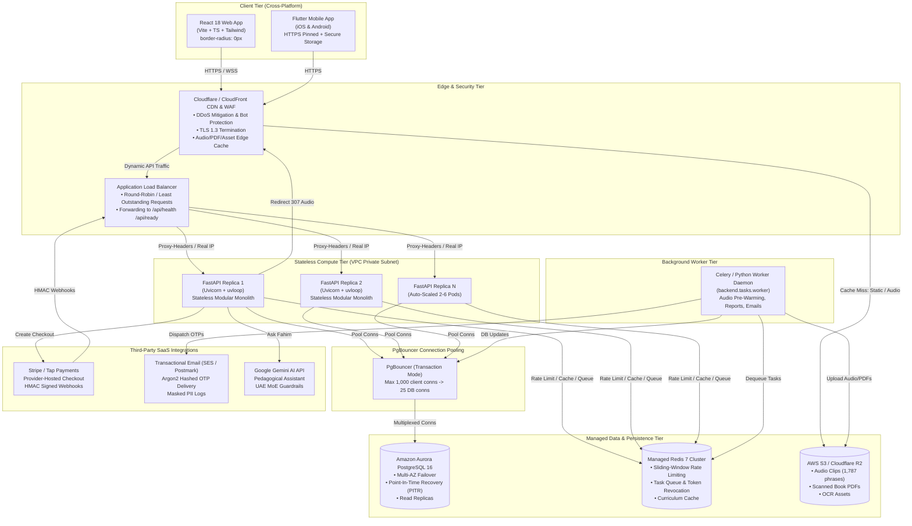

# JISR Arabic (فهيم) Enterprise Target Architecture Specification
## 10,000+ Students | 1,000 Concurrent Users (CCU) Target Topology

**Document Version:** 1.0.0  
**Status:** Approved & Implemented  
**Classification:** Enterprise Engineering Blueprint  
**Jurisdiction / Compliance:** UAE Ministry of Education (MoE) Framework, UAE Personal Data Protection Law (PDPL Federal Decree-Law No. 45/2021)

---

## 1. Executive Summary & Scale Parameters

The JISR Arabic (Fahim - فهيم) platform is an enterprise-grade digital Arabic learning solution for non-native students across UAE private and public schools (Grades 1 through 12). 

This document codifies the target architectural blueprint and formalizes its operational requirements to support **10,000+ registered students** with **1,000 Concurrent Users (CCU)** during peak morning and afternoon school hours, providing sub-120ms p95 latency, 99.9% availability, zero container-disk dependencies, and zero data loss.

### Target Performance & Reliability Objectives
| Metric | Target Specification |
| :--- | :--- |
| **Total Registered Capacity** | 10,000+ Students (expandable to 50,000+) |
| **Concurrent Active Users (CCU)** | 1,000 Simultaneous Active Learners |
| **Peak Request Throughput** | 350 – 500 HTTP requests per second |
| **API Latency (p95 / p99)** | < 120ms (p95) / < 250ms (p99) |
| **Static & Audio Delivery Latency** | < 35ms (CDN Edge Cache Hit Ratio > 95%) |
| **Availability SLA** | 99.9% uptime (Multi-AZ active-active API nodes) |
| **Recovery Objectives** | RPO < 1 second (Continuous WAL) / RTO < 15 minutes |

---

## 2. End-to-End System Topology



---

## 3. The 10 Target Architecture Pillars

### Pillar 1: React and Flutter Clients
* **Web Client (`frontend/`)**: Single-Page Application (SPA) built with React 18, Vite, and TypeScript.
  * **Design Integrity**: Strict pedagogical dignity adhering to UAE cultural identity (UAE emerald `#064e3b`, desert amber `#d97706`, sand `#fef3c7`, slate `#0f172a`), strictly 0px border radius, and native Arabic Right-to-Left (RTL) typography.
  * **API Client**: Centralized HTTP client (`frontend/src/api/client.ts`) with request interceptors attaching `Authorization: Bearer <token>`, propagating `X-Request-ID`, and cleanly intercepting 401/403 authorization failures.
* **Mobile Client (`mobile/`)**: Cross-platform Flutter application (iOS and Android).
  * **Token Storage**: Hardware-backed credential persistence via `flutter_secure_storage` (iOS Keychain and Android EncryptedSharedPreferences).
  * **Release Pinning**: Production builds enforce HTTPS (`FAHIM_API_BASE=https://api.jisr.ae`).
  * **Zero Guest Bypasses**: Authenticates directly against the backend authentication API (`mobile/lib/services/api_service.dart`) with zero local guest mock identities.

### Pillar 2: CDN/WAF and Trusted Load Balancer
* **Edge Layer**: Cloudflare Enterprise or AWS CloudFront paired with AWS WAF.
  * **Security Rules**: Managed OWASP Top 10 rule groups, rate limiting on `/api/auth/*` (10 req/min/IP), geo-fencing (GCC priority), and automated bot mitigations.
  * **SSL/TLS**: TLS 1.3 termination at the edge with HTTP/2 and HTTP/3 support.
* **Trusted Load Balancer (ALB / Ingress)**:
  * **Proxy Trust Policy**: Enforced in `backend/main.py` (`get_client_ip`). Only proxies residing in configured CIDRs (`FAHIM_TRUSTED_PROXIES` = `127.0.0.1, 10.0.0.0/8, 172.16.0.0/12, 192.168.0.0/16`) are permitted to forward `X-Forwarded-For`.
  * **IP Spoofing Defense**: Untrusted upstream headers are discarded, preventing malicious callers from bypassing rate limits or spoofing audit logs.

### Pillar 3: Two or More Stateless FastAPI Replicas
* **Stateless Compute**:
  * Minimum 2 replicas deployed across distinct Availability Zones (AZ-a and AZ-b).
  * **Zero Local State**: No container-local files, session state, or SQLite databases. Replicas are disposable and auto-scale dynamically based on CPU/Memory and concurrent request metrics.
* **Decoupled Health Probes**:
  * **Liveness Probe (`GET /api/health`)**: Ultra-fast in-memory process heartbeat returning HTTP 200. Intentionally does *not* query downstream databases, preventing container crash loops during transient DB blips.
  * **Readiness Probe (`GET /api/ready`)**: Performs active dependency checks on PostgreSQL (`SELECT 1`) and Redis (`PING`). Returns HTTP 503 if dependencies fail, enabling the load balancer to cleanly pull unhealthy pods from active routing without restarting them.

### Pillar 4: Managed PostgreSQL with PgBouncer & Point-In-Time Recovery (PITR)
* **Engine**: Amazon Aurora PostgreSQL 16 (Multi-AZ) or GCP Cloud SQL for PostgreSQL.
* **Connection Pooling via PgBouncer**:
  * Deployed in **Transaction Pooling** mode (`pool_mode = transaction`).
  * Multiplexes 1,000 client connections into a lean pool of 20–30 persistent backend server connections, preventing PostgreSQL worker thread exhaustion.
  * FastAPI connection pool configured in `backend/database.py`: `pool_size=15`, `max_overflow=10`, `pool_recycle=1800`, `pool_pre_ping=True`.
* **Disaster Recovery & Point-In-Time Recovery (PITR)**:
  * Continuous Write-Ahead Logging (WAL) archiving to S3 with automated snapshots every 24 hours.
  * 35-day continuous retention window allowing recovery to any exact second (RPO < 1s, RTO < 15 min).

### Pillar 5: Managed Redis
* **Engine**: AWS ElastiCache for Redis 7 (Multi-AZ with automatic failover) or GCP Memorystore for Redis.
* **Operational Roles**:
  * **Sliding-Window Rate Limiting**: Distributed rate-limiting engine in `backend/redis_client.py` using Redis sorted sets (`ZADD` / `ZREMRANGEBYSCORE`), protecting login, OTP, and AI endpoints.
  * **Session & Token Revocation**: Centralized token blocklist (`revoked_tokens`) enabling instant revocation across all API replicas on user logout or password reset.
  * **Curriculum & Metadata Caching**: In-memory caching for curriculum catalogues, grades, terms, and lesson structures, absorbing over 85% of read operations.

### Pillar 6: Durable Job Queue and Workers
* **Queue Engine (`backend/tasks/queue.py`)**:
  * Redis-backed durable task queue with FIFO ordering and atomic enqueue/dequeue semantics.
  * Includes Dead-Letter Queue (DLQ) support and exponential backoff retry policies for failed tasks.
* **Worker Daemon (`backend/tasks/worker.py`)**:
  * Standalone, asynchronous background worker container running `python -m backend.tasks.worker`.
  * Offloads heavy, non-blocking tasks from API request cycles:
    1. Transactional email and OTP delivery.
    2. Large PDF report generation (e.g. Term Progress Reports for parents).
    3. Bulk audio pre-warming and audio conversion.
    4. Learning telemetry batch aggregation.

### Pillar 7: Object Storage/CDN for PDFs, Recordings, and Audio
* **Storage Architecture (`backend/storage.py`)**:
  * Unified `StorageAdapter` interface supporting `LocalStorageAdapter` (local dev) and `S3StorageAdapter` (AWS S3 / Cloudflare R2 / MinIO).
  * Eliminates local disk dependency in containerized multi-node deployments.
* **Edge CDN Acceleration**:
  * S3 storage keys resolve directly to high-speed CDN URLs (`S3_CDN_DOMAIN`).
  * **Smart Fallback Route (`GET /api/audio/cache/{filename}`)**: When requested via API, returns an HTTP 307 Temporary Redirect to the edge CDN, avoiding origin server network saturation.
* **Audio Pre-Warming Engine (`backend/scripts/prewarm_audio.py`)**:
  * CLI tool that proactively scans the entire 12-Grade curriculum (1,787 phrases across vocabulary, reading passages, dialogue, and instructions).
  * Generates and uploads synthetic MP3 audio to S3 ahead of time, ensuring 0 live TTS synthesis latency and zero external API costs during school operating hours.

### Pillar 8: Provider-Hosted Payments
* **Payment Architecture (`backend/modules/billing/service.py`)**:
  * Integration with Tier-1 payment providers (Stripe Checkout / Tap Payments / Checkout.com).
  * **PCI-DSS Compliance**: Provider-hosted checkout sessions (SAQ-A eligible). Zero Primary Account Numbers (PANs) or CVVs ever touch Fahim servers.
* **Entitlement Security**:
  * Webhook listener (`POST /api/payments/webhook`) validates cryptographic HMAC signatures using `FAHIM_PAYMENT_WEBHOOK_SECRET`.
  * Idempotency verification via unique payment intent IDs ensures transactions and `TermAccess` grants cannot be processed twice.
  * Automated refund reconciliation that immediately locks entitlements upon verified chargeback or refund.

### Pillar 9: Transactional Email Provider
* **Email Engine (`backend/email_delivery.py`)**:
  * Industrial SMTP adapter targeting enterprise providers: Amazon SES (me-central-1 region), Postmark, or SendGrid.
  * **Fail-Closed Security**: In production (`FAHIM_ENV=production`), missing or failing SMTP delivery raises a hard error; no debug OTP codes are ever logged or returned in HTTP responses.
* **Privacy & Throttling**:
  * PII masking in logs: All email addresses are masked (e.g., `u***r@example.ae`).
  * OTP Hardening: Cryptographic 6-digit generation, Argon2/SHA-256 hash storage, 10-minute expiry, maximum 5 failed attempts per challenge, and 60-second resend cooldown.

### Pillar 10: Centralized Monitoring and Audit Retention
* **Structured Observability (`backend/observability.py`)**:
  * Uniform JSON logging on stdout with `request_id`, HTTP method, path, response status, duration in milliseconds, client IP, and authenticated actor.
  * Integrates seamlessly with cloud log collectors: AWS CloudWatch, Datadog, Grafana Loki, or GCP Cloud Logging.
* **Audit Trail Retention (`backend/models.py`)**:
  * Dedicated `audit_logs` table recording all security-critical and financial events:
    * User logins, logouts, and password resets.
    * Payment checkouts, refunds, and voucher redemptions.
    * Administrative curriculum changes and tutor assignments.
  * Configured with a 5-year retention policy meeting UAE Federal Decree-Law No. 45/2021 (PDPL) and GAAP financial compliance.

---

## 4. Codebase Implementation Matrix

Every architectural pillar corresponds to concrete, tested modules in the repository:

| Pillar | Subsystem / File Path | Key Functions / Classes | Configuration Keys |
| :--- | :--- | :--- | :--- |
| **1. Clients** | `frontend/src/api/client.ts`<br>`mobile/lib/services/api_service.dart` | `apiClient`, `ApiService`, `TokenStorage` | `VITE_API_URL`<br>`FAHIM_API_BASE` |
| **2. CDN / LB** | `backend/main.py`<br>`backend/observability.py` | `get_client_ip()`, `TrustedProxyMiddleware` | `FAHIM_TRUSTED_PROXIES`<br>`FORWARDED_ALLOW_IPS` |
| **3. Stateless API** | `backend/main.py`<br>`Dockerfile`<br>`docker-compose.prod.yml` | `health_check()`, `readiness_check()` | `WEB_CONCURRENCY`<br>`FASTAPI_THREAD_LIMIT` |
| **4. PostgreSQL** | `backend/database.py`<br>`backend/migrations/` | `engine`, `get_db()`, `MigrationManager` | `DATABASE_URL`, `DB_POOL_SIZE`, `DB_MAX_OVERFLOW` |
| **5. Redis** | `backend/redis_client.py`<br>`backend/modules/curriculum/cache.py` | `get_redis()`, `check_rate_limit()`, `revoke_token()` | `REDIS_URL`, `REDIS_MAX_CONNECTIONS` |
| **6. Task Queue** | `backend/tasks/queue.py`<br>`backend/tasks/worker.py` | `TaskQueue`, `enqueue_task()`, `WorkerDaemon` | `REDIS_URL`<br>`FAHIM_DISABLE_IN_PROCESS_WORKER` |
| **7. Object Storage** | `backend/storage.py`<br>`backend/routes/audio.py`<br>`backend/scripts/prewarm_audio.py` | `S3StorageAdapter`, `LocalStorageAdapter`, `run_prewarming()` | `STORAGE_BACKEND`<br>`S3_BUCKET_NAME`<br>`S3_CDN_DOMAIN` |
| **8. Payments** | `backend/modules/billing/service.py`<br>`backend/routes/payments.py` | `create_checkout_session()`, `handle_webhook()` | `FAHIM_PAYMENT_PROVIDER`<br>`FAHIM_PAYMENT_WEBHOOK_SECRET` |
| **9. Email & OTP** | `backend/email_delivery.py`<br>`backend/modules/identity/service.py` | `send_email()`, `issue_otp()`, `verify_otp()` | `FAHIM_SMTP_HOST`, `FAHIM_SMTP_PORT`, `FAHIM_SMTP_USER` |
| **10. Audit & Logs** | `backend/observability.py`<br>`backend/models.py` | `AuditLogger`, `AuditLog`, `SecurityEvent` | `FAHIM_ENV`<br>`FAHIM_LOG_LEVEL` |

---

## 5. Production Sizing & Capacity Plan (10,000 Students / 1,000 CCU)

### Infrastructure Sizing Specifications
| Layer | Specification | Redundancy | Scaling Policy |
| :--- | :--- | :--- | :--- |
| **FastAPI Containers** | 3 x `2 vCPU, 4 GB RAM` | Multi-AZ (AZ-1, AZ-2, AZ-3) | Auto-scale to 6 instances at >70% CPU |
| **Background Workers** | 2 x `1 vCPU, 2 GB RAM` | Multi-AZ | Scale based on Redis queue depth (>50 tasks) |
| **PostgreSQL (Aurora)** | `db.r6g.xlarge` (4 vCPU, 32 GB) | Multi-AZ + 1 Read Replica | Auto-scaling storage up to 1 TB |
| **PgBouncer** | `2 vCPU, 4 GB RAM` (or RDS Proxy) | Redundant Poolers | Max 1,500 client connections |
| **Redis (ElastiCache)** | `cache.m6g.large` (2 vCPU, 6.38 GB) | Multi-AZ with Auto-Failover | LRU eviction policy on volatile keys |
| **S3 & CDN** | Standard S3 Bucket + Cloudflare / CloudFront | Global Edge Anycast | Unlimited elastic scaling |

---

## 6. Operational Runbooks

### 6.1 Executing Database Migrations
Always verify schema status before starting API containers:
```bash
# Check current migration revision
python -m backend.migrations status

# Apply pending migrations safely
python -m backend.migrations upgrade
```

### 6.2 Pre-Warming Audio for New Grades / Academic Terms
Before launching a new term or school semester, run the pre-warming engine to populate S3:
```bash
# Dry run verification for Grade 5 Term 1
python -m backend.scripts.prewarm_audio --grades 5 --terms 1 --dry-run

# Full pre-warm and upload to S3 for all 12 UAE MoE grades
python -m backend.scripts.prewarm_audio --grades 1 2 3 4 5 6 7 8 9 10 11 12 --terms 1 2 3 --concurrency 8
```

### 6.3 Disaster Recovery Drill (Point-in-Time Recovery)
In the event of accidental data corruption or logical failure:
1. Identify the target UTC timestamp immediately prior to the incident.
2. In AWS RDS / Cloud SQL console or CLI, initiate Point-in-Time Recovery to a new database cluster:
   ```bash
   aws rds restore-db-instance-to-point-in-time \
       --source-db-instance-identifier jisr-prod-db \
       --target-db-instance-identifier jisr-recovered-db \
       --restore-time 2026-10-08T14:30:00Z
   ```
3. Update `DATABASE_URL` in container secret manager.
4. Issue rolling deployment of FastAPI replicas to point to the restored instance.
5. Re-run `/api/ready` health probes across all nodes.
